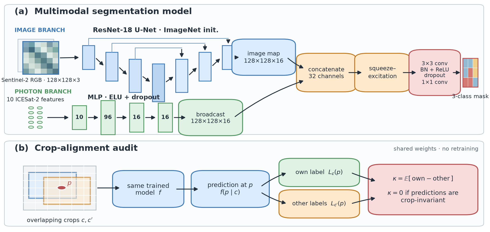

# Crop-Label Alignment

**Auditing crop-dependent auto-labels in remote-sensing segmentation**

[Paper](paper/main.pdf) |
[Supplement](paper/supp.pdf) |
[Reproduce](REPRODUCE.md) |
[Artifact notes](SUPPLEMENT_README.md)

This repository contains the WACV 2027 review artifact for a benchmark audit of
crop-dependent automatic labels. The central question is simple: if two
overlapping crops show the same source pixel, do their automatically generated
labels agree? If not, a model can be rewarded for following the crop window
rather than the scene.

The paper introduces crop-label alignment, a diagnostic that is exactly zero for
any predictor whose output is independent of the crop being read. A nonzero value
on the disagreement set indicates that model predictions align with
crop-specific labels.



## Current WACV Artifact

| Item | Location |
|---|---|
| Main review PDF | `paper/main.pdf` |
| Supplement PDF | `paper/supp.pdf` |
| Main LaTeX source | `paper/main.tex` |
| Supplement source | `paper/supp.tex` |
| Standalone diagnostic | `cropalign.py` |
| End-to-end verifier | `verify.py` |
| Release notes | `SUPPLEMENT_README.md` |

The review PDFs are anonymous. The LaTeX source contains the public repository
URL for camera-ready mode, but the review-mode PDF withholds it for double-blind
submission. Use an anonymized 4open.science mirror for WACV review.

## Main Result

On the audited sea-ice benchmark, the optical-only primary model trained on
per-patch labels shows stronger crop-label alignment than its matched
scene-label control. The contrast is positive on every held-out acquisition, but
the paper reports it descriptively because the folds share geography, tiles and
most training data.

That evidence boundary is intentional: the artifact verifies supported claims
without pretending that dependent folds are independent samples.

## Quick Start

```bash
python -m venv .venv
source .venv/bin/activate
python -m pip install --upgrade pip
python -m pip install -r requirements.txt
python cropalign.py
python verify.py
```

The verifier checks the released code, evidence tables and paper-facing
aggregates. It is designed to fail loudly if a required artifact is missing.

## Repository Structure

```text
cropalign.py                 standalone crop-label-alignment implementation
verify.py                    artifact verification entry point
DESIGN.json                  expected experiment grid
REPRODUCE.md                 command guide for regenerating reported quantities
experiments/
  sea_ice/                   compact sea-ice evidence and scripts
  floods/                    flood calibration and external mechanism checks
paper/
  main.tex                   WACV review manuscript source
  main.pdf                   WACV review manuscript
  supp.tex                   supplementary source
  supp.pdf                   supplementary PDF
  figures/                   paper figures, including architecture diagram
docs/                        audit and reproducibility notes
```

Large raw imagery, local caches, model checkpoints and private training outputs
are intentionally excluded. The artifact verifies the claims it can support and
labels summary-only evidence explicitly.

## Citation

During double-blind review, cite the paper by title and use the anonymous
artifact link. The camera-ready repository citation will use the public URL:

```bibtex
@misc{crop_label_alignment_2027,
  title  = {Crop-Label Alignment: Auditing Crop-Dependent Auto-Labels in Remote-Sensing Segmentation},
  author = {Anonymous Authors},
  year   = {2027},
  note   = {WACV review artifact}
}
```
